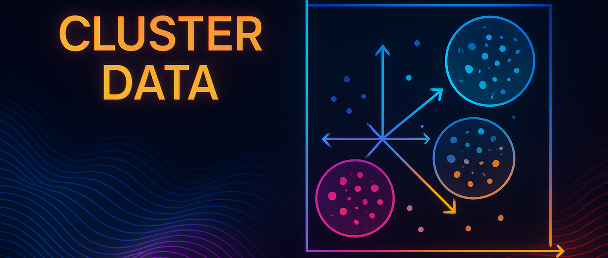

# 🕷️ Scrapy &  Clustering Data

> Combine web scraping with data clustering to collect, clean, and analyze web data.  
> Built with **Scrapy**, **Pandas**, and **Scikit-learn**.  

---

  
  

##  Overview

This project demonstrates how to:  

 Scrape structured data from websites using **Scrapy**. 
 Clean and preprocess the scraped data with **pandas**. 
 Apply clustering algorithms  (K-Means, DBSCAN, Agglomerative). 
 Visualize results and export outputs to CSV/JSON. 

##  Features

 Multi-spider Scrapy project structure. 
 Configurable item pipelines (cleaning / storage). 
 Clustering pipeline with selectable algorithms. 
 Export clusters and sample visualizations. 
 Example commands to run scraping and clustering.

## 🛠️ Tech Stack

 Python 3.8+ 
 Scrapy 
 pandas, numpy 
 scikit-learn 
 matplotlib / seaborn 
 joblib

